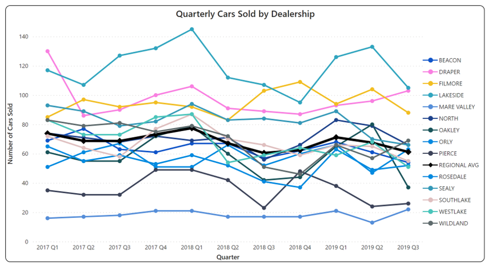
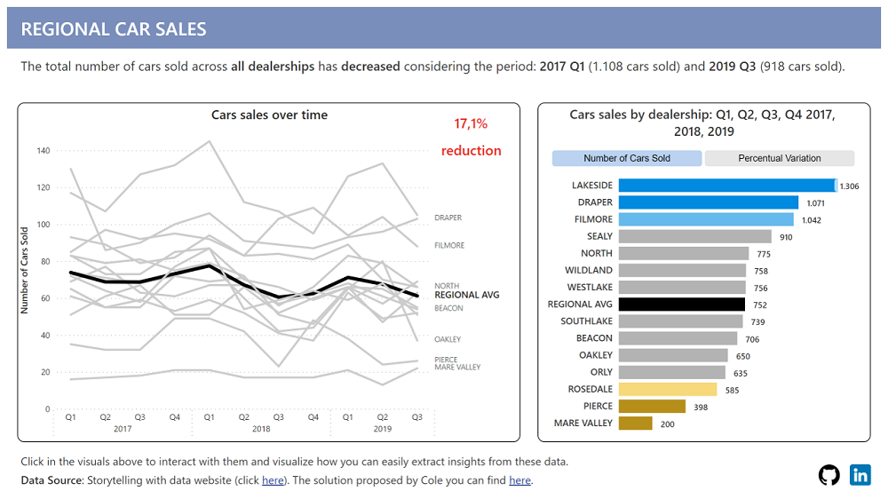
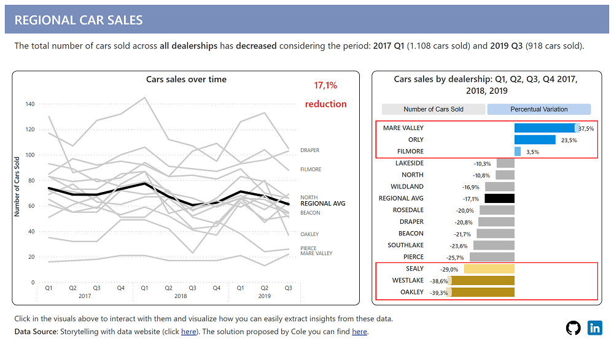

# Storytelling with data

This project was inspired by Cole's exercise from the book "Storytelling with data: Let's Practice".  
You can find the description and instructions in this <a target="_blank" rel="noopener noreferrer" href="https://community.storytellingwithdata.com/exercises/one-little-changeand-a-redesign">link</a>. 

## **Problem** 

You have been presented with the chart below (Picture 1) and asked to make sense of it, as it may appear to be confusing.

Picture 1

As part of the analysis, the regional car sales data from various dealerships over the years 2017, 2018, and 2019 is being evaluated to analyze the dealerships' performance.

## **Solution** 

Using Power BI and data visualization techniques, and inspired by Cole's suggestion (found in this [link](https://community.storytellingwithdata.com/discover/5a9b65dd-2c0d-4fed-895b-879238735939/images?seed=3f44ed8a)), I came up with the following:

Picture 2

Picture 3

You can access the Power BI in this [link]().

## **Conclusion & Insights** 

We can conclude that: 
* The total number of cars sold by all dealerships has decreased over the years (a 17.1% reduction).
* The average number of cars sold by all dealerships was 752 cars.
  - In 2017, the average was 285
  - In 2018, the average was 268 (a reduction of 6%)
  - In 2019, the average was 200 (a reduction of 25.4%) 
* There were dealerships that had an increase of the years (Picture 3), such as:
  - Filmore (TOP 3 in sales): 3.5% increase
  - Orly: 23.5% increase 
  - Mare Valley (BOTTOM 1 in sales): 37.5% increase 
* The dealerships with the highest reduction were (Picture 3): 
  - Oakley with a 39.3% reduction, 
  - Westlake with a 38.6% reduction 
* The company should conduct an investigation into the steepest decline in car sales at Oakley and Westlake. In addition, Sealy, which has accumulated a reduction of 29% in car sales over the analyzed period, should also be closely monitored despite ranking fourth in terms of car sales. Also monitor and, if possible, investigate these dealerships reduction of over 20%: Rosedale, Draper, Beacon, Southlake and Pierce. 
* And the company should also provide encouragement to dealerships that managed to maintain their sales performance despite the overall negative trend.
